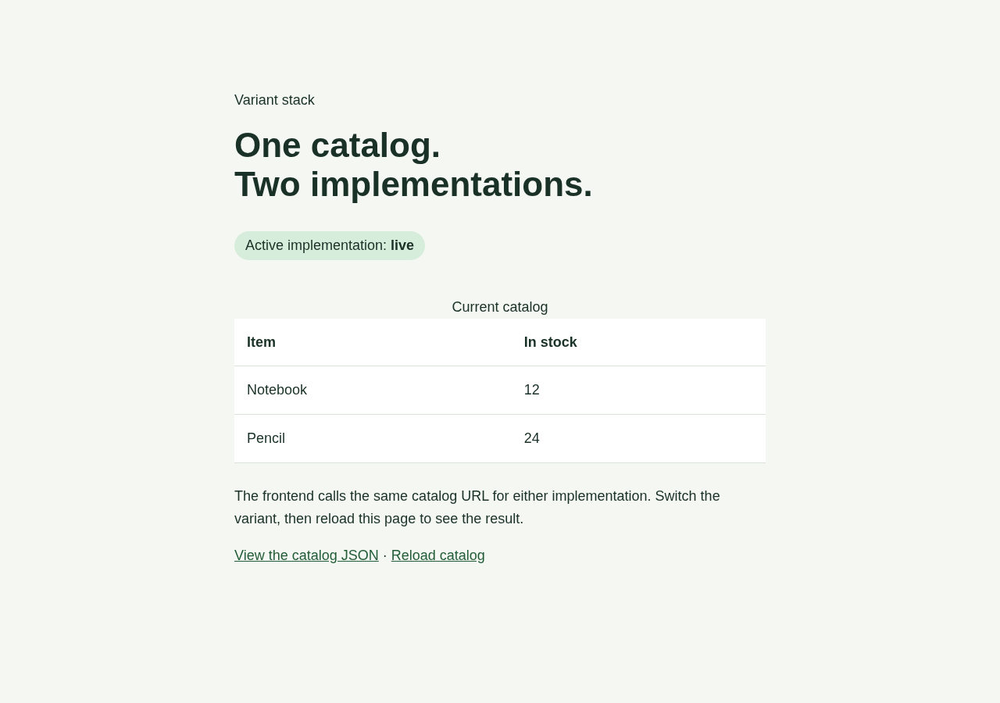
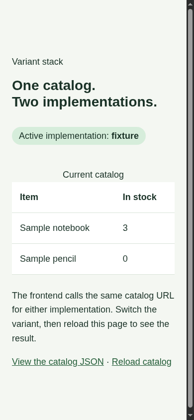

# Recorded walkthrough

Tested locally on Linux on 2026-09-20 with the PR build, Python's standard
library, Chromium, and real terminal sessions. No Docker or external services
were used for this example. macOS was not manually exercised.

## Acceptance checks and observations

| Check | Input / observation | Result |
| --- | --- | --- |
| Complete graph | `fed start` starts storage, catalog, frontend and the dependency-only stack node; console is excluded without its profile | Pass |
| Real downstream data | Browser → frontend → catalog → storage returns Notebook (12) and Pencil (24), with implementation `live` | Pass |
| Shared defaults and template | Label/environment reaches catalog and browser; storage has no self-dependency; live catalog gets its command and storage URL from its template | Pass |
| Saved preference | `variant set fixture` changes the next selection while status still reports the running `live` implementation | Pass |
| Invalid pin | `variant set catalog:missing` fails and leaves the existing variants file unchanged | Pass |
| Whole-stack restart | After `restart --all`, the same frontend URL returns Sample notebook (3), Sample pencil (0), and `fixture` | Pass |
| Command-line pin | `--variant catalog:live restart catalog` overrides the saved fixture preference; later status without the flag reports `live` | Pass |
| Dependency opt-out | After stop, `start catalog` with saved fixture starts catalog alone, with no storage process | Pass |
| Failed command | A start naming a missing service fails; monitoring of the existing HTTP stack resumes | Pass |
| Health failure | Console `fail` makes HTTP requests return 503; catalog and frontend become failing while their processes stay alive | Pass |
| Health recovery | Console `recover` restores successful HTTP responses and healthy status with unchanged PIDs | Pass |
| Terminal lifetime | `attach console`, `catalog`, detach with Ctrl+P/Ctrl+Q, reconnect; transcript is replayed and console remains alive | Pass |
| TUI | Dashboard shows `catalog (fixture)`, Healthy; details show Variant fixture; stack is Completed / oneshot | Pass |
| Rendering | Live page at 1280×900 and fixture page at 390×844 inspected; narrow layout has no horizontal overflow | Pass |
| Isolation | `isolate enable` assigns distinct ports; the HTTP stack and supervisor use them successfully | Pass |
| Read-only preview | `start --watch --dry-run` leaves the existing supervisor PID unchanged | Pass |
| Cleanup | `fed stop` without the console profile stops HTTP services and the console/host; no example processes remained in `/proc` | Pass |

The automated portion is reproducible with the command in [README.md](README.md).
It records each command and HTTP response in a retained `evidence.json`, rather
than only reporting successful exit codes. `tests/variant_stack_example_test.rs`
also runs that walkthrough against the compiled CLI.

## Issues found and corrected

- The first verification script looked for process parameter ports in service
  status. It now uses the documented `fed ports list --json` command.
- The real HTTP checks exposed supervisor initialization resolving already-owned
  ports as conflicts. The supervisor now collects live managed ports, including
  those of failing-but-alive services, before resolving probe URLs.
- Starts/restarts could leave the old daemon watching old PIDs and a previously
  selected variant. Mutating commands hand off supervision, then reattach using
  registered variants and active service profiles. The error path also resumes
  supervision. Attach is serialized with startup, and port reservations are
  released before recovering services bind their listeners.
- `fed validate` called a dependency-only service `unknown`. Its summary now uses
  the canonical service type and reports `oneshot`.
- The initial large heading overflowed a narrow viewport. Responsive sizing
  fixes the rendered mobile layout.
- The console log walkthrough needs `--profile console`; the documented command
  now includes it. Frontend and console explicitly ignore catalog dependency
  failure so the error page and recovery console remain available.

The initial HTTP walkthrough failed at the health transition; it was not counted
as a passing run. After the fixes, the complete scenario passed, including the
failure and recovery paths. Screenshots below show the rendered output, not
mockups.

## Screenshots

Live inventory, desktop:

Fixture inventory, narrow viewport:

